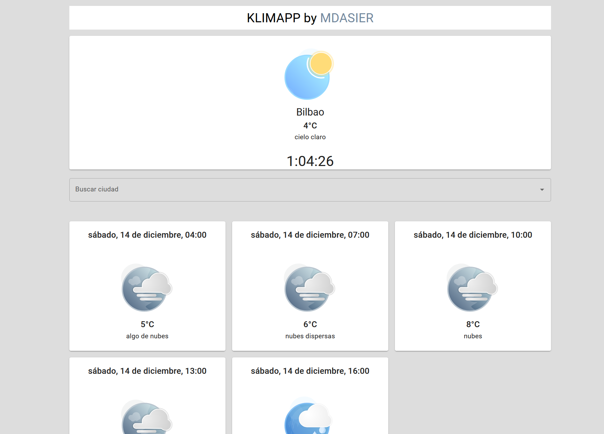

# 🌦️ Klimapp

**KlimApp** es una aplicación interactiva para obtener información sobre el clima y el pronóstico del tiempo en diferentes ciudades. Está construida con **React**, utiliza la API de **OpenWeatherMap**, y está desplegada en **Vercel**.

---

## 🚀 **Características**

- Buscar ciudades y obtener el clima actual.
- Ver el pronóstico del tiempo para los próximos días.
- Interfaz moderna y responsiva utilizando **Material UI**.
- Idioma en español y temperaturas en grados Celsius.

---

## 🛠️ **Tecnologías utilizadas**

- **React**: Biblioteca de JavaScript para construir interfaces de usuario.
- **TypeScript**: Extensión de JavaScript para un desarrollo más seguro y escalable.
- **Axios**: Cliente HTTP para realizar solicitudes a la API.
- **Lodash**: Para funciones de utilidad como el `debounce`.
- **Material UI**: Para diseño e interfaz de usuario.
- **OpenWeatherMap API**: Fuente de datos climáticos.
- **Lottie**: Fuente de animaciones climáticas.

---

## 📦 **Estructura del proyecto**

src/ ├── components/ # Componentes reutilizables │ ├── SearchBar.tsx # Barra de búsqueda de ciudades├── WeatherCard.tsx # Componente para mostrar los datos del clima ├── services/ # Funciones de interacción con APIs │ ├── weatherApi.ts # API para obtener el clima actual │ ├── forecastApi.ts # API para obtener el pronóstico del clima │ ├── cityApi.ts # API para obtener sugerencias de ciudades ├── App.tsx # Componente principal ├── index.tsx # Punto de entrada de React

---

## 🌐 **Demo en línea**

Visita la DEMO de la aplicación desplegada en Vercel:  
[**KlimApp**](https://klimapp.vercel.app)

---

## **AsierMD en Linkedin** 
[**Linkedin**](https://www.linkedin.com/in/asiermd/)
